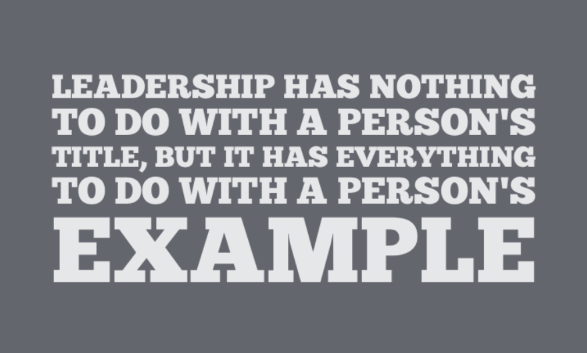

This package was developed as part of a first-party live effects photo editing application, Pixd, that Chad Martin and I were building together. While the project ultimately never reached the finish line, we were quite proud of the progress we made. Now it's years in the past, I feel the best thing to do is release it to the wild for historic and educational purposes. Is the code perfect? No - far from it. Did it serve its purpose? For sure - it got the job done (and quite well, IMO)

Feel free to use this code as inspiration for your own version, as I've done with Eric Loyer's and @freqdec's. If you migrate it to another language or platform, I'd love to hear about it!

This is copyright 2023 Cameron Perry, and distributed under the Creative Commonse Attribution-NonCommercial-ShareAlike (CC BY-NC-SA) [license](https://creativecommons.org/licenses/by-nc-sa/4.0/legalcode).

---
# PASlabType

PASlabType is a stripped-down and built-up port of Eric Loyer's [SlabType algorithm][1] for ActionScript and @freqdec's [slabText jQuery plugin][2]

## Requirements & Installation
+ Add CoreText.framework to your project's Build Phases (Link Binary With Libraries)
+ Add the postscript (usually) names of the fonts you're using in the project to the project's plist file (See the demo)
+ Add fonts to the app's Target (Build Phases -> Copy Bundle Resources)
+ reference the PASlabType.h file in your controller's header

[1]: http://erikloyer.com/index.php/blog/the_slabtype_algorithm_part_1_background/
[2]: https://github.com/freqdec/slabText
